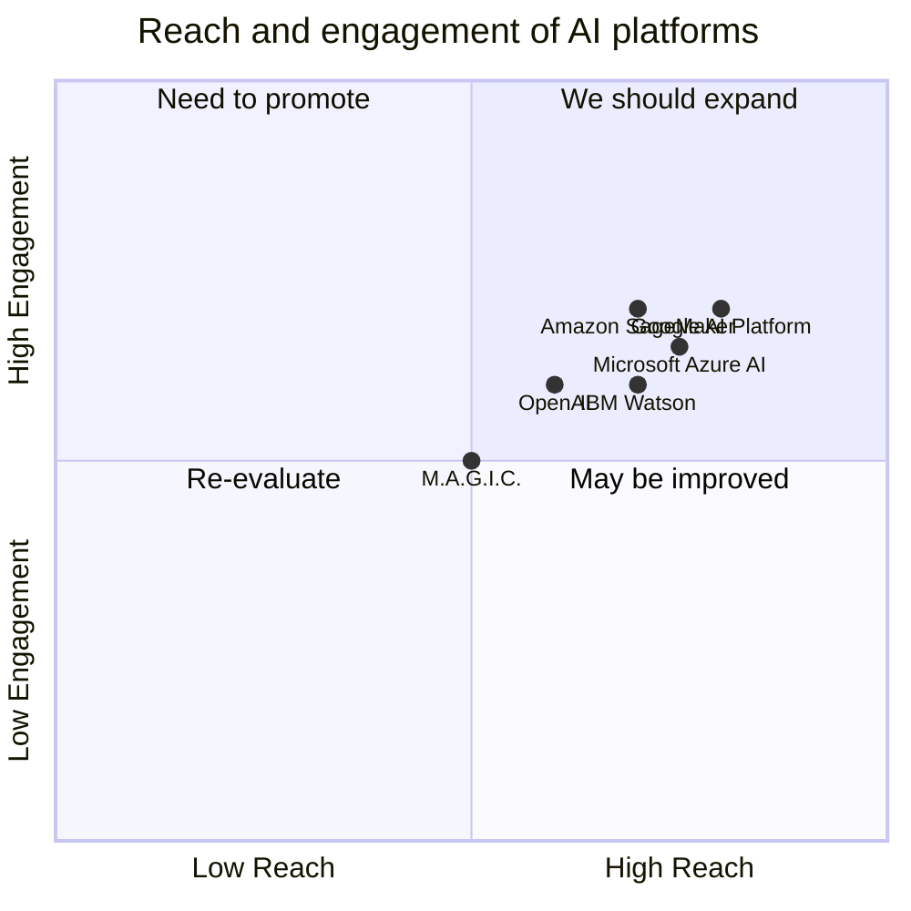

## Original Requirements
The M.A.G.I.C. Application is a platform designed to revolutionize global collaboration, problem-solving, and adaptive intelligence. It leverages genetic regenerative algorithms, diverse neural network types, and continual learning mechanisms to provide a flexible and robust framework capable of handling a wide range of tasks. The application will have foundational components for genetic algorithms, population management, and basic neural network operations. It will also have mechanisms for generating and evolving different neural network layers based on tasks and objectives, dynamic switching between various learning paradigms, continual learning and adaptation to new tasks, an adaptive genetic algorithm for handling diverse neural networks and tasks, storage for learned information, insights, and experiences, and a user-friendly interface for task input, monitoring, and feedback.

## Product Goals
```python
[
    "Develop a minimalist base framework for genetic algorithms, population management, and basic neural network operations.",
    "Implement mechanisms for dynamic layer generation, learning paradigm integration, and continual learning.",
    "Create a user-friendly interface for task input, monitoring, and feedback."
]
```

## User Stories
```python
[
    "As a user, I want to input tasks easily so that the system can start processing them.",
    "As a user, I want to monitor the progress of the tasks so that I can understand how the system is performing.",
    "As a user, I want to provide feedback on the results so that the system can learn and improve.",
    "As a user, I want the system to adapt to new tasks so that it can handle a wide range of problems.",
    "As a user, I want the system to store learned information, insights, and experiences so that it can use them in future tasks."
]
```

## Competitive Analysis
```python
[
    "IBM Watson: A powerful AI platform with advanced analytics and machine learning capabilities. However, it lacks the genetic algorithm and dynamic layer generation features of M.A.G.I.C.",
    "Google AI Platform: Offers a wide range of machine learning services and tools. But it doesn't provide the same level of task-specific neural network evolution and continual learning mechanisms.",
    "Microsoft Azure AI: Provides a comprehensive suite of AI services and tools. Yet, it doesn't have the same level of user-friendly interface for task input, monitoring, and feedback.",
    "Amazon SageMaker: A fully managed service for building, training, and deploying machine learning models. However, it lacks the dynamic learning paradigm switching and adaptive genetic algorithm features.",
    "OpenAI: A research organization that develops and promotes friendly AI for the benefit of all. But it doesn't provide the same level of global collaboration and problem-solving capabilities."
]
```

## Competitive Quadrant Chart


## Requirement Analysis
The product should be a comprehensive AI platform that combines genetic algorithms, diverse neural network types, and continual learning mechanisms. It should have a minimalist base framework, dynamic layer generation, learning paradigm integration, continual learning, an adaptive genetic algorithm, a memory module, and a user-friendly interface.

## Requirement Pool
```python
[
    ("Develop a minimalist base framework for genetic algorithms, population management, and basic neural network operations.", "P0"),
    ("Implement mechanisms for dynamic layer generation, learning paradigm integration, and continual learning.", "P1"),
    ("Create a user-friendly interface for task input, monitoring, and feedback.", "P0"),
    ("Develop an adaptive genetic algorithm for handling diverse neural networks and tasks.", "P2"),
    ("Implement a memory module for storing learned information, insights, and experiences.", "P2")
]
```

## UI Design draft
The user interface should be clean and intuitive. It should have a task input field where users can easily enter their tasks. There should be a monitoring dashboard where users can track the progress of the tasks and the performance of the system. The interface should also have a feedback mechanism where users can provide their feedback on the results. The layout should be simple and easy to navigate, with clear labels and instructions.

## Anything UNCLEAR
There are no unclear points.