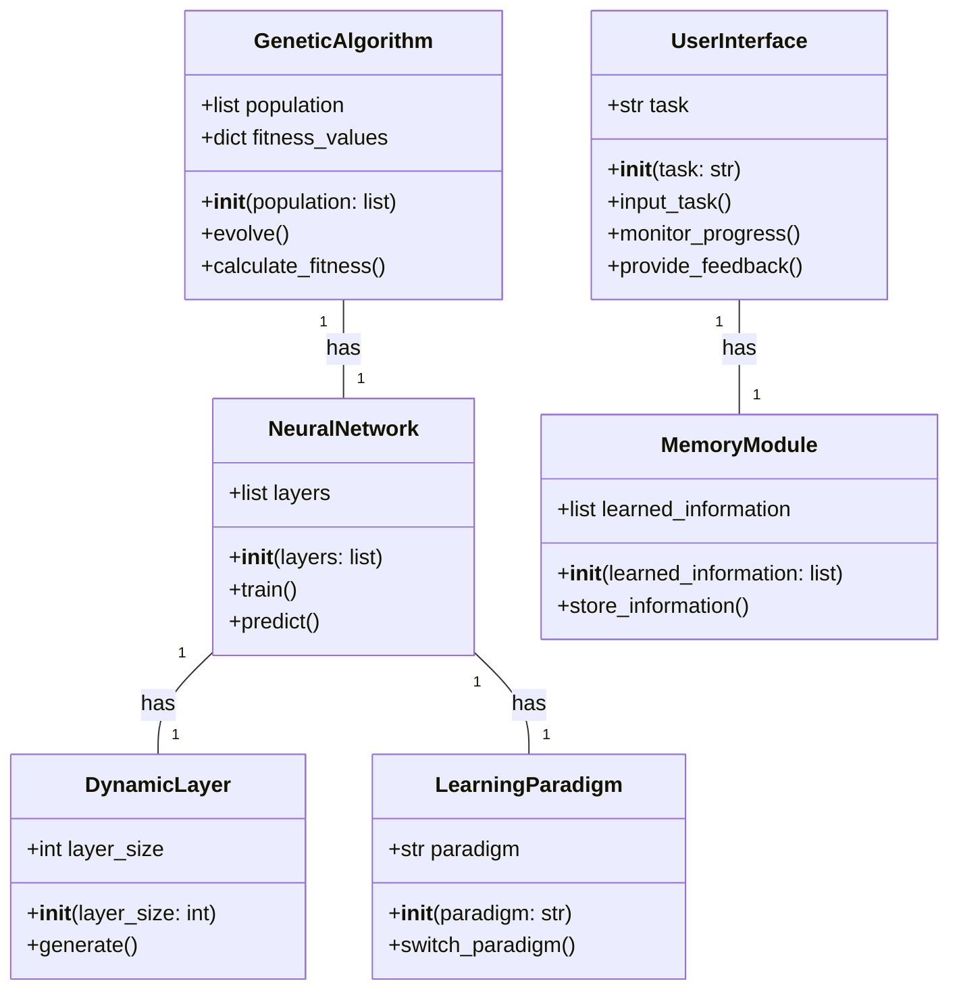
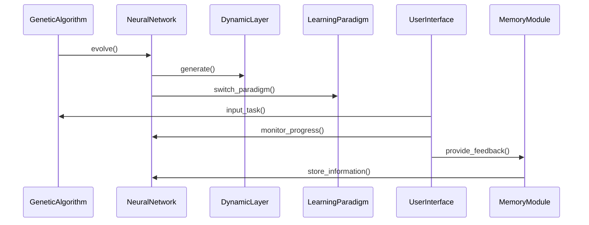

## Implementation approach
The M.A.G.I.C. application is a complex system that combines genetic algorithms, diverse neural network types, and continual learning mechanisms. The implementation will be done in Python, leveraging several open-source libraries for machine learning and genetic algorithms. 

The difficult points of the requirements include the development of a minimalist base framework for genetic algorithms, population management, and basic neural network operations, the implementation of mechanisms for dynamic layer generation, learning paradigm integration, and continual learning, and the creation of a user-friendly interface for task input, monitoring, and feedback. 

For the genetic algorithms and neural network operations, we will use DEAP (Distributed Evolutionary Algorithms in Python), an open-source library that provides tools for the design of evolutionary algorithms. For the dynamic layer generation and learning paradigm integration, we will use Keras, a high-level neural networks API, written in Python and capable of running on top of TensorFlow, CNTK, or Theano. For the continual learning, we will use TensorFlow, an open-source library for machine learning and artificial intelligence. For the user interface, we will use Flask, a lightweight WSGI web application framework.

## Python package name
```python
"magic_ai"
```

## File list
```python
[
    "main.py",
    "genetic_algorithm.py",
    "neural_network.py",
    "dynamic_layer.py",
    "learning_paradigm.py",
    "user_interface.py",
    "memory_module.py"
]
```

## Data structures and interface definitions


## Program call flow


## Anything UNCLEAR
The requirement is clear to me.